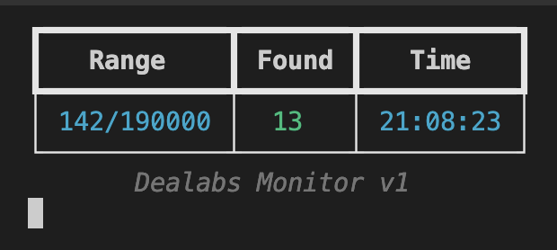

# Dealabs monitor .LysC0

## pip install [required lib]

- pip install requests
- pip install requests_html
- pip install bs4
- pip install selenium
- pip install rich

## setup .json file

- Webhook : url discord webhook
- Range : monitoring try number (put a high number, ex : 999999)
- Master_link : put link dyw monitoring (only dealabs link ex : https://www.dealabs.com/top, https://www.dealabs.com/nouveaux, ...) 
- await_time : loop await time (ex : 2)
- Keyword : Specific keyword (if keyword found, webhook send ping user / check setup.json for exemple)

## how to run the monitor ? ##

into the directory (Dealabs_Monitor_PUBLIC) run this command :
- python3 monitor_dealabs.py

## dm discord, bug fix..

.sail or sail#1056
